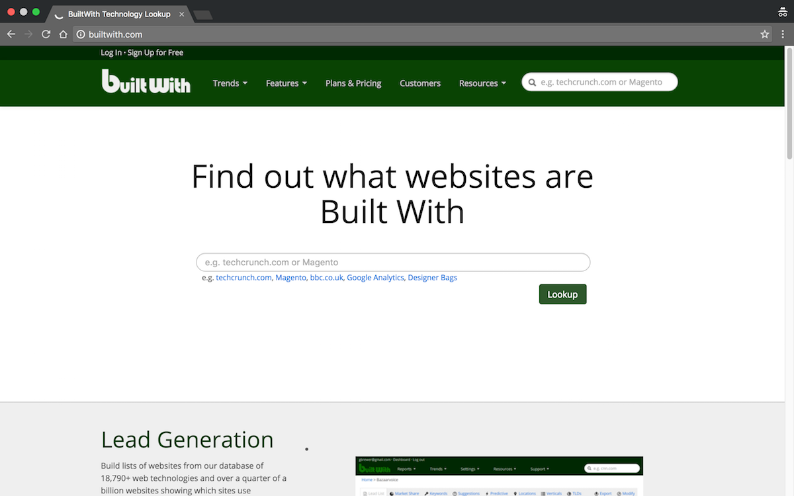
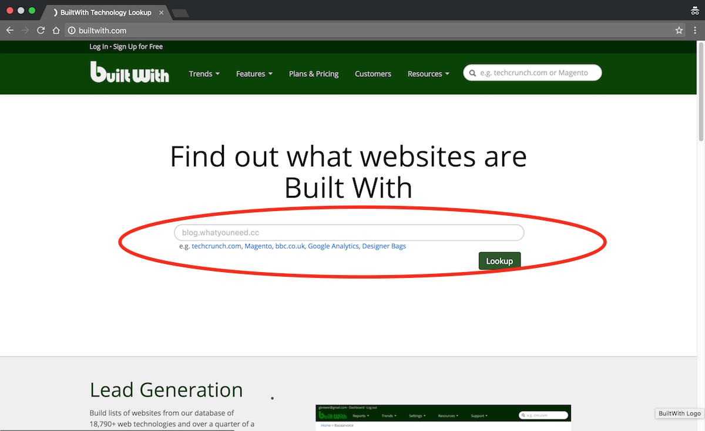
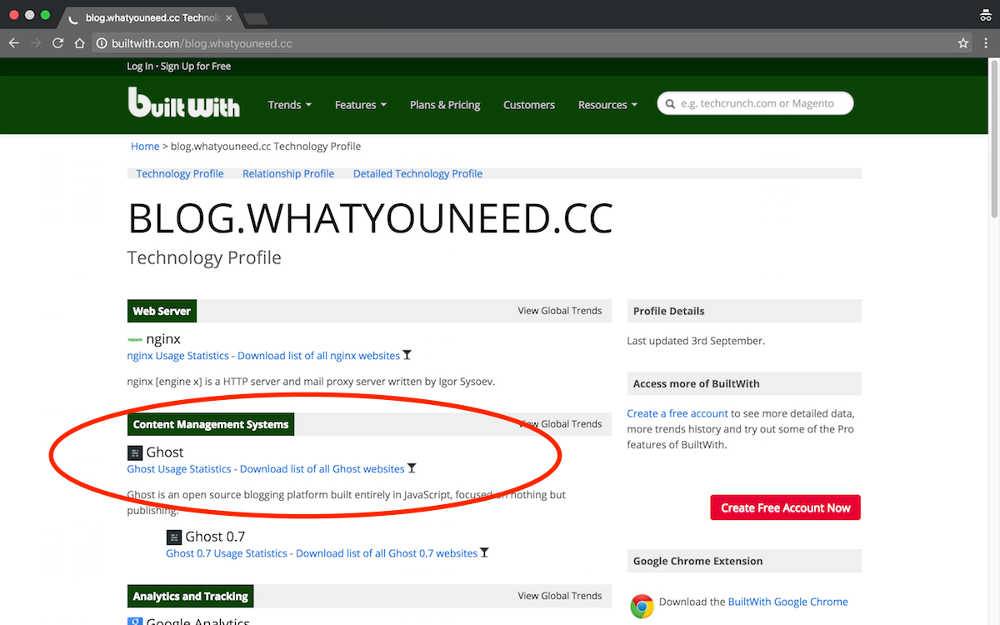
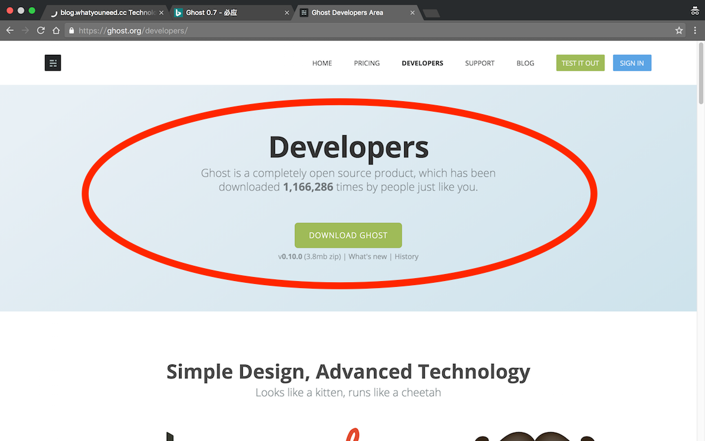
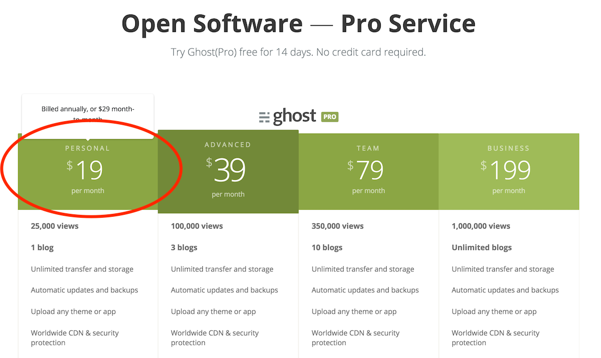

虽然做了教育，但是还是不时的有朋友来问网站开发的事。

> 半，这种网站你能做吗？要多少钱，需要多长时间？

“**不要重复造轮子**”，这是高效开发最核心的东西。大多时候，搭建一个平台根本不需要你从零开始做，你的需求可能在很早已经就有许多人在帮你解决的了，所以问题的核心是，你需要找到现有最好的框架或者工具，然后再找到专注于这个工具最好的工程师。

因为在你投入这件事情之前，那个专注于这个领域的人已经帮你犯了无数的错误、走了无数的弯路、解决了无数头痛的问题。

这种工作高端的称呼叫做“技术选型”，接地气的说法叫做：你怎么判断什么是最好的框架或者工具？

那假设今天你是一个不懂技术的小白？当你找到了某个领域牛逼哄哄的产品时，你应该怎么样才能知道他们使用什么东西做的呢？

举个非常非常简单的例子。

我大概分析了一下这个产品：
- 初创企业，还是大学生团队，所以应该不会花太多钱在平台搭建上面；
- 内容性产品，那应该会用CMS的框架就对了；
- 独立域名，访问速度也很快，大概不是托管的；

既然这样，我就用一个非常牛的技术勘探器"BuiltWith""去看看这个东西是用什么做的。

## 1. 访问“Built with”
在浏览器中输入[www.builtwith.com](www.builtwith.com)访问这个技术勘探神器

## 2. 输入目标域名
在官网页面的地址栏中输入你想查询的产品的网页地址，比如: [blog.whatyouneed.cc](blog.whatyouneed.cc)

## 3. 查看技术详情
在`Content Management System` 模块，你就可以看见**Ghost**这个东西了，所以果然用的CMS系统，除此之外，你还可以查看他们的服务器配置，网站数据分析工具，DNS，CDN等等技术架构。

顺藤摸瓜，再看看Ghost CMS系统开发者的介绍，居然还是开源的。

再去首页一看，还有成熟的托管方案，所以其实一个月19刀给他们，就基本什么都不用管了。

看到这种集成托管与开源自主开发的CMS解决方案，开发者都是非常开心的，因为这靠着开源工具吸引人气，靠着Saas做收费服务的产品一定差不到哪里去，而且基本部署也是非常的便捷。

到这里，作为一个技术小白，你也可以通过这种方式Get Things Done，快速找到专注于这个领域的开发者：
- 到QQ群/Segmentfault/v2ex搜索“Ghost CMS 技术交流”；
- 或者直接到Ghost中文论坛搜索找到哪些活跃的论坛版主，勾搭业务；

相信我，这种方式靠谱而且便宜的多。

