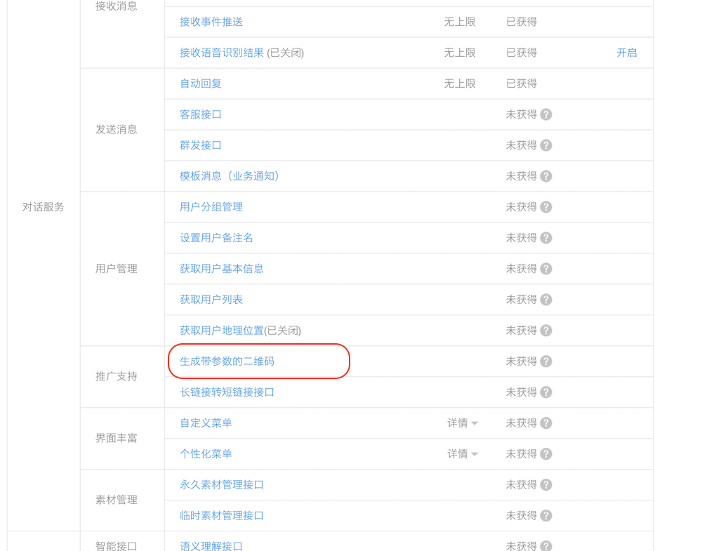

> 「营销科学化」 是一个被叫唤了很多年的概念，在过去的站长时代，这个动作很容易被百度统计、GA等方法实现：通过Guest Post等内容营销的手段，然后后台就可以很直观的看到不同渠道的数据表现：SEO、社交媒体、直接进入、关键字购买等等渠道，我们可以很从容的针对“强表现”的营销渠道加强马力。今天的文章讲在手机媒体时代，如何精准的进行渠道监测，并分享2个方法。

## 着陆页监测

`着陆页`(Landing Page)指的是访客通过点击第三方渠道直接到达的网页，该网页通常以请求访客完成某项动作为目的。着陆页强调的是**转化**，比如经常看到的招聘H5页面，最后带着“投递简历”按钮的，活动报名页面最后带“预约报名”按钮的，这种强调**转化**，通常带有Call to Action按钮的单页网页都算做是着陆页。

比如，当我们在各个渠道发布了一个招聘的H5广告以后，我们希望知道这个H5广告在不同渠道的点击数，应该怎么做呢？下面这个视频会教你如何利用Google URL 网址构建起来实现这个功能，强大且免费！

<embed src="http://static.video.qq.com/TPout.swf?vid=u03328xivez&auto=0" allowFullScreen="true" quality="high" width="480" height="400" align="middle" allowScriptAccess="always" type="application/x-shockwave-flash"></embed>

## 微信公众号监测

在微信公众号的后台，我们可以监测到这些用户通过什么方式关注我们的：

- 公众号搜索
- 扫描二维码
- 图文页右上角菜单
- 图文页内公众号名称
- 名片分享
- 支付后关注
- 其他合计

所以，你可能可以知道：用户是在购买了你的产品后，点击了付款后页面下的关注称为你的粉丝；你也可能知道：用户是在某个地方关注了你的二维码后成为你的粉丝。但是`扫描二维码`，`名片分享`等信息并不能具体的告诉我：它们是从**什么地方**、**哪些渠道**知道我的产品，进而扫描或者分享的！

因为，产品的推广总是不仅仅是在微信里面，我们会：

- 去知乎回答问题，最后套个二维码
- 去简书写故事，最后套个二维码
- 去论坛写软文，最后套个二维码
- 去上下游产品置换一个带二维码的banner广告
- ……

所以，我总是想知道：咦，到底那个地方给我带来的流量最高？那我才知道接下来我应该专供那个渠道才是，对吧！

想要实现这样的功能，目前在微信上只有通过认证的服务号才有这个接口实现：

你可以通过下面3个方法去实现：

2. 用类似有赞/微盟/水滴等第三方管理平台做渠道参数；
3. 自己动手（搜索关键字：微信生成带参数的二维码教程）
3. 找程序员做服务号开发；

最后，半撇的观点是：**有一个自己的网站，然后把网站和公众号的内容打通**。这是最省心的办法，因为你可以掌握所有的渠道信息，就不会被微信这个圈子限制住了。而且，**建站远远没有你想象的那么困难**。

 

广告时间：第三期「新媒体骇客训练营」即将开班，点击[预约占座](http://www.bpteach.com)。

